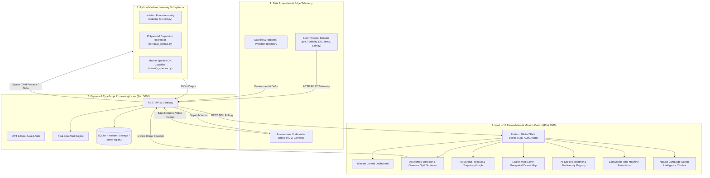

# DeepSea Guardian (DeepSee) — Complete End-to-End Project Documentation 🌊📘

---

## 1. Executive Summary & Problem Statement

### 1.1 Overview
**DeepSea Guardian (DeepSee)** is an autonomous ocean intelligence and mission control platform. It bridges the critical technological gap in marine ecosystem preservation by combining **IoT sensor mesh telemetry**, **machine learning anomaly detection**, **computer vision species identification**, **predictive trajectory modeling**, and **autonomous drone dispatching**.

### 1.2 The Problem
- Over **80% of deep-sea environments** remain unmapped, unobserved, and unprotected.
- Traditional ocean monitoring depends on manual satellite surveys or infrequent maritime research expeditions, resulting in delayed responses (days to weeks) to catastrophic chemical spills, illegal deep-sea dumping, and biodiversity loss.
- Acidification, oxygen minimum zones (OMZs), and plastic density escalation require real-time, autonomous, automated intervention at the edge.

### 1.3 The Solution
DeepSea Guardian provides a unified mission control surface that:
1. Continuously ingests 5-dimensional physical-chemical sensor telemetry.
2. Identifies chemical spills and abnormal environmental disruptions in under **200 milliseconds** using unsupervised ML (Isolation Forest).
3. Automatically computes interception vectors and dispatches the nearest autonomous underwater drone (AUV) for video verification.
4. Predicts the 6-hour drift and dispersion curve of pollution events.
5. Employs computer vision on drone camera feeds to track and classify endangered marine life with AI confidence metrics.

---

## 2. End-to-End System Architecture



---

## 3. Machine Learning Pipelines & Mathematical Formulations

### 3.1 Water Quality Anomaly Detector
- **Model**: `IsolationForest` (Scikit-Learn)
- **Model Location**: `ml/anomaly_model.pkl`
- **Execution Script**: `ml/predict.py`
- **Feature Vector**:
  $$\mathbf{x} = [\text{temperature}, \text{pH}, \text{salinity}, \text{oxygen}, \text{turbidity}] \in \mathbb{R}^5$$

#### Isolation Forest Mechanics:
The algorithm recursively partitions the multi-dimensional feature space using random axis-aligned splits. Anomalous states (e.g., pH dropping to $6.5$, turbidity surging to $12.0\text{ NTU}$, dissolved oxygen crashing to $2.1\text{ mg/L}$) are isolated at noticeably shorter tree depths than nominal ocean baseline readings:
$$s(\mathbf{x}, n) = 2^{-\frac{\mathbb{E}(h(\mathbf{x}))}{c(n)}}$$
- When anomaly score $s \ge 0.5$ (or prediction $y = -1$), the system triggers `isAnomaly: true`.

---

### 3.2 Pollution Spread & Dispersion Forecast
- **Model**: Polynomial dispersion model with stochastic environmental turbulence
- **Execution Script**: `ml/forecast_spread.py`
- **Formula**:
  For prediction horizon $h \in \{1, 2, 3, 4, 5, 6\}$ hours:
  $$S(h) = \text{clamp}\Big(S_0 + k_{\text{trend}} \cdot h + 0.30 \cdot \sin(0.80 h) + \epsilon, \; 1.0, \; 10.0\Big)$$
  where:
  - $S_0$: Current severity level ($1.0$ to $10.0$)
  - $k_{\text{trend}} \in \{+0.15 \text{ (increasing)}, 0.02 \text{ (stable)}, -0.12 \text{ (decreasing)}\}$
  - $\epsilon \sim \mathcal{U}(-0.2, 0.2)$: Local wave turbulence noise

---

### 3.3 Computer Vision Marine Species Classifier
- **Model**: Spatial Color Histogram + Normalized Pixel Feature Classifier
- **Model Location**: `ml/species_classifier.pkl`
- **Execution Script**: `ml/classify_species.py`
- **Image Pipeline**:
  1. Base64 payload decoded to raw binary buffer.
  2. Resized and normalized to standardized RGB grid $\mathbf{I} \in \mathbb{R}^{32 \times 32 \times 3}$.
  3. Color histogram extracted per channel ($256$ bins per channel, compressed to $3 \times 32 \times 8$).
  4. Concatenated with flattened normalized spatial matrix:
     $$\mathbf{f}_{\text{img}} = \Big[\frac{\mathbf{h}_{\text{color}}}{32 \times 32}, \; \frac{\mathbf{I}_{\text{flattened}}}{255.0}\Big]$$
  5. Multi-class soft probability vector computed via `predict_proba()` returning highest predicted class and confidence percentage ($P_{\text{max}} \times 100\%$).

---

## 4. API Specification & Interface Contracts

### 4.1 Run Sensor Anomaly Detection
- **Endpoint**: `POST /api/sensors/predict`
- **Description**: Evaluates sensor telemetry with the Isolation Forest model.

#### Request Body:
```json
{
  "temperature": 3.1,
  "ph": 6.5,
  "salinity": 34.5,
  "oxygen": 2.1,
  "turbidity": 12.0
}
```

#### Response (200 OK):
```json
{
  "isAnomaly": true,
  "status": "success"
}
```

---

### 4.2 Forecast Pollution Dispersion
- **Endpoint**: `POST /api/pollution/forecast`
- **Description**: Generates 6-hour forward-looking severity dispersion data.

#### Request Body:
```json
{
  "severity": 7.5,
  "trend": "increasing",
  "name": "Industrial Chemical Leak"
}
```

#### Response (200 OK):
```json
{
  "status": "success",
  "event": "Industrial Chemical Leak",
  "currentSeverity": 7.5,
  "trend": "increasing",
  "predictions": [
    { "hour": 1, "label": "+1h", "severity": 7.97 },
    { "hour": 2, "label": "+2h", "severity": 8.08 },
    { "hour": 3, "label": "+3h", "severity": 8.30 },
    { "hour": 4, "label": "+4h", "severity": 8.16 },
    { "hour": 5, "label": "+5h", "severity": 7.86 },
    { "hour": 6, "label": "+6h", "severity": 8.29 }
  ]
}
```

---

### 4.3 Classify Marine Species Image
- **Endpoint**: `POST /api/species/classify`
- **Description**: Accepts base64 encoded photo from drone feed or user upload.

#### Request Body:
```json
{
  "image_b64": "data:image/webp;base64,UklGRnoGAABXRUJQVlA4..."
}
```

#### Response (200 OK):
```json
{
  "status": "success",
  "species": "Hawksbill Turtle",
  "confidence": 0.942
}
```

---

## 5. Frontend & UI/UX Architecture

### 5.1 Design Principles
- **Theme**: Abyss Dark Glassmorphism (`#030712`, `#0a1128`, `#0c1a30`).
- **Accent Tokens**: Cyan (`#06b6d4`), Bioluminescent Emerald (`#10b981`), Alarm Rose (`#f43f5e`), Electric Violet (`#8b5cf6`).
- **Typography**: Inter Sans + JetBrains Mono for telemetry metrics.

### 5.2 Key Frontend Components
1. **`AnomalyDetector.tsx`**:
   - Real-time parameter sliders with instant value binding.
   - High-contrast preset buttons (`Clean Ocean Baseline` vs `⚠️ Trigger Chemical Spill Scenario`).
   - Dynamic animated alarm banner with 1-click **Autonomous Drone Dispatch** button.
2. **`PollutionForecast.tsx`**:
   - Interactive severity controls and dynamic 6-hour trend graph rendering.
3. **`SpeciesClassifier.tsx`**:
   - Drag-and-drop file upload area.
   - 1-click test marine sample cards (`Hawksbill Turtle`, `Blue Whale`, `Clownfish`, `Hammerhead Shark`).
   - AI confidence visual meter and conservation status badge.
4. **`OceanMap.tsx` & `MapCard.tsx`**:
   - Responsive Leaflet map with CartoDB Dark Matter tiles.
   - Dynamic marker scaling linked to the **Time Machine** projection horizon.
5. **`TimeMachine.tsx`**:
   - Multi-step timeline slider (`Today`, `1 Month`, `6 Months`, `1 Year`, `5 Years`) that synchronizes all dashboard KPIs and map points in real time.

---

## 6. Directory Structure

```
DeepSea/
├── backend/
│   ├── src/
│   │   ├── db/                 # SQLite database and schema initialization
│   │   ├── routes/             # REST routing modules
│   │   │   ├── alerts.ts       # Alert management & notification dispatch
│   │   │   ├── drones.ts       # Drone telemetry & dispatch routing
│   │   │   ├── pollution.ts    # Pollution hotspots & /forecast endpoint
│   │   │   ├── sensors.ts      # Sensor telemetry & /predict anomaly endpoint
│   │   │   └── species.ts      # Biodiversity catalog & /classify vision endpoint
│   │   └── server.ts           # Express server entry point (Port 5000)
│   └── package.json
├── frontend/
│   ├── public/                 # Static images, icons, and sample marine photos
│   │   └── species/            # Real marine wildlife test photos
│   ├── src/
│   │   ├── app/                # Next.js App Router
│   │   │   ├── dashboard/      # Mission Control main page
│   │   │   ├── species/        # Biodiversity & AI Species Identifier
│   │   │   ├── map/            # Fullscreen Ocean Map view
│   │   │   ├── drones/         # Autonomous Drone Center
│   │   │   ├── alerts/         # System alert feed
│   │   │   ├── reports/        # Environmental analytics & reporting
│   │   │   └── assistant/      # AI Ocean Assistant Chatbot
│   │   ├── components/         # Reusable React components
│   │   │   ├── ai/             # AnomalyDetector, PollutionForecast, SpeciesClassifier
│   │   │   ├── layout/         # DashboardShell, Sidebar, Topbar, BottomTabBar
│   │   │   ├── map/            # Leaflet Map components
│   │   │   └── ui/             # Card, Badge, Modal, StatCard, Slider, Button
│   │   ├── store/              # Zustand global state management
│   │   └── lib/                # Constants, formatting helpers, and utilities
│   ├── next.config.mjs
│   ├── tailwind.config.ts
│   └── package.json
├── ml/
│   ├── anomaly_model.pkl       # Serialized Isolation Forest model
│   ├── species_classifier.pkl  # Serialized Marine Vision classifier
│   ├── ocean_sensor_data.csv   # Physical-chemical training dataset
│   ├── predict.py              # Anomaly detection execution script
│   ├── forecast_spread.py      # Pollution trajectory projection script
│   └── classify_species.py     # Species image classification script
├── .env.example                # Template environment variables
├── .gitignore                  # Security exclusions (credentials, DBs, caches)
├── package.json                # Root workspace orchestration
├── README.md                   # Repository overview and documentation
└── PROJECT_DOCUMENTATION.md    # Complete in-depth system manual
```

---

## 7. Setup & Deployment Guide

### 7.1 Prerequisites
- **Node.js**: `v20.x` or higher
- **Python**: `3.9` to `3.12` with `pip`
- **Git**

### 7.2 Installation
```bash
# 1. Clone repository
git clone https://github.com/tiwariraman884/DeepSee.git
cd DeepSee

# 2. Install root and package dependencies
npm install
npm --prefix backend install
npm --prefix frontend install

# 3. Install Python Machine Learning dependencies
pip install numpy pandas scikit-learn pillow joblib
```

### 7.3 Start Full Platform
```bash
npm run dev
```
- **Mission Control UI**: `http://localhost:3000`
- **Backend API Server**: `http://localhost:5000`

---

## 8. Verification & Test Plan

| Test Case | Steps | Expected Outcome |
|---|---|---|
| **Clean Water Baseline** | Click "Clean Ocean Baseline" in Anomaly Detector -> Run Detection | Output: `Normal Water Quality Verified` |
| **Chemical Spill Simulation** | Click "⚠️ Trigger Chemical Spill Scenario" in Anomaly Detector | Instant ML detection -> Red alarm banner -> "Dispatch Nearest Drone" button appears |
| **Emergency Drone Dispatch** | Click "🚁 Dispatch Nearest Drone for Emergency Inspection" | Live telemetry status updates to `AquaDrone Alpha Dispatched · ETA: 3m 45s` |
| **6-Hour Spread Forecast** | Set severity to 7.5, trend to `increasing` -> Click "Generate 6h Forecast" | Hour-by-hour projection curve from +1h to +6h rendered |
| **Species Vision Classification** | Go to `/species` -> Click "🐟 Hawksbill Turtle" preset -> Run Classification | Output: `Identified Marine Species: Hawksbill Turtle`, AI Confidence score displayed |

---

## 9. Conclusion
DeepSea Guardian provides a complete, modern, robust, and extensible AI-powered mission control system for marine conservation. The modular separation between frontend presentation, backend REST services, and Python machine learning engines enables rapid scaling, real-time sensor integration, and real-world deployment across research institutions and autonomous maritime fleets.
