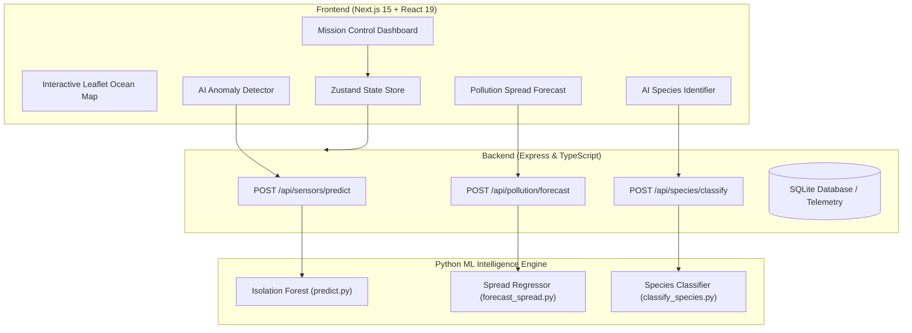

# DeepSea Guardian (DeepSee) 🌊🤖

[](https://nextjs.org/)
[](https://react.dev/)
[](https://www.typescriptlang.org/)
[](https://tailwindcss.com/)
[](https://www.python.org/)
[](https://scikit-learn.org/)
[](LICENSE)

> **DeepSea Guardian** is an enterprise-grade, AI-powered autonomous marine intelligence and mission control platform. It provides real-time ocean telemetry monitoring, machine-learning-driven water quality anomaly detection, 6-hour pollution drift trajectory forecasting, computer vision marine species classification, and autonomous drone fleet dispatch.

---

## 📑 Table of Contents

- [Overview & Vision](#-overview--vision)
- [Key Features](#-key-features)
- [System Architecture](#-system-architecture)
- [Tech Stack](#-tech-stack)
- [Machine Learning Pipelines](#-machine-learning-pipelines)
- [API Reference](#-api-reference)
- [Project Directory Structure](#-project-directory-structure)
- [Getting Started](#-getting-started)
- [Step-by-Step Demo Walkthrough](#-step-by-step-demo-walkthrough)
- [Security & Best Practices](#-security--best-practices)
- [License](#-license)

---

## 🌊 Overview & Vision

Oceans cover more than 70% of Earth's surface, yet over 80% of deep-sea environments remain unmonitored and vulnerable to catastrophic chemical spills, illegal dumping, plastic accumulation, and biodiversity loss.

**DeepSea Guardian** bridges this gap by combining:
1. **IoT Sensor Mesh Telemetry**: Live streams of physical-chemical water parameters (pH, turbidity, dissolved oxygen, salinity, temperature).
2. **Predictive Machine Learning**: Real-time anomaly detection and drift modeling.
3. **Computer Vision**: Instant image classification of endangered marine wildlife.
4. **Autonomous Response**: Direct dispatching of autonomous underwater vehicles (AUVs) and aerial drones to verified hotspot coordinates.

---

## ✨ Key Features

### 1. 🧠 ML Water Quality Anomaly Detector & Chemical Spill Simulator
- **Algorithm**: Scikit-Learn **Isolation Forest** unsupervised anomaly detector.
- **Interactive Scenarios**:
  - **Clean Ocean Baseline**: Verifies normal oceanic conditions (pH 8.05, Turbidity 0.4 NTU, Dissolved Oxygen 5.2 mg/L).
  - **🚨 Chemical Spill Simulation**: 1-click trigger simulating industrial acidic/oil runoff (pH 6.5, Turbidity 12.0 NTU, Oxygen 2.1 mg/L).
- **Instant Response**: Upon anomaly detection, triggers automated critical alerts and displays a 1-click **Drone Dispatch** action.

### 2. 🚁 Autonomous Drone Fleet Dispatch
- **Mission Control**: Tracks active drone units (e.g. `AquaDrone-Alpha`) across sectors.
- **Emergency Dispatch**: Computes nearest available drone route, estimated time of arrival (ETA), and streams telemetry for hotspot inspection.

### 3. 📈 AI Pollution Spread & 6-Hour Trajectory Forecast
- **Model**: Polynomial non-linear drift model factoring in initial severity and environmental trends (`increasing`, `stable`, `decreasing`).
- **Visual Trajectory**: Renders hour-by-hour (+1h to +6h) predictive severity progression curves.

### 4. 🐟 Marine Species Computer Vision Classifier
- **Model**: Multi-channel color histogram and spatial pixel feature classifier for marine biodiversity.
- **Interactive Vision UI**:
  - Drag-and-drop or file upload for custom marine wildlife photos.
  - **1-Click Test Presets**: Test instantly with real samples (Hawksbill Sea Turtle, Blue Whale, Clownfish, Hammerhead Shark).
  - **Results**: Returns species identification and real-time AI confidence score (%).

### 5. 🗺️ Interactive Ocean Monitoring Map
- **Leaflet & OpenStreetMap**: Multi-layered geospatial visualization supporting pollution heatmap clusters, active drone markers, and stationary sensor buoys.
- **Region Filtering**: Filter by Coral Triangle, North Pacific Gyre, Mediterranean Sea, Great Barrier Reef, and more.

### 6. ⏳ Ecosystem Time Machine
- Project ecosystem health, biodiversity impact, and pollution progression across **1 Month**, **6 Months**, **1 Year**, and **5 Year** horizons.

### 7. 🤖 AI Ocean Assistant
- Dedicated natural-language marine assistant providing real-time queries on sensor health, pollution statistics, and emergency protocol recommendations.

---

## 🏛️ System Architecture



---

## 💻 Tech Stack

### Frontend
- **Framework**: Next.js 15.1 (App Router), React 19
- **Styling**: Tailwind CSS, Vanilla CSS animations, Glassmorphism design tokens
- **State Management**: Zustand (App Store, Auth Store, Alerts Store)
- **Icons & UI**: Lucide React, Framer Motion
- **Maps**: Leaflet, React-Leaflet, CartoDB Dark Matter basemaps

### Backend
- **Runtime**: Node.js v20+, Express
- **Language**: TypeScript (`tsx` watcher)
- **Database**: SQLite (`better-sqlite3`) for persistent missions, telemetry, and alerts
- **Inter-Process Communication**: Node.js `child_process` execution of Python ML subroutines

### Machine Learning & Data Science
- **Environment**: Python 3.9+
- **Libraries**: Scikit-Learn, NumPy, Pandas, Pillow (PIL), Joblib, PyTorch, torchvision
- **Pre-trained Models**:
  - `ml/anomaly_model.pkl`: Isolation Forest for multi-dimensional water quality telemetry
  - `ml/species_classifier.pt`: Transfer-learned MobileNetV3-Small marine life classifier (~72.6% validation accuracy)

Install the ML dependencies with `python -m pip install -r ml/requirements.txt`.
For the CPU-only PyTorch build (no NVIDIA GPU required):
`python -m pip install torch torchvision --index-url https://download.pytorch.org/whl/cpu`

---

## 🤖 Machine Learning Pipelines

| Task | Model | Input Features | Output |
|---|---|---|---|
| **Water Anomaly Detection** | Isolation Forest (`anomaly_model.pkl`) | Temperature (°C), pH Level, Salinity (PSU), Dissolved Oxygen (mg/L), Turbidity (NTU) | `isAnomaly: boolean`, `status: string` |
| **Pollution Spread Forecast** | Polynomial Spread Regressor (`forecast_spread.py`) | Current Severity (1-10), Trend (`increasing`, `stable`, `decreasing`) | 6-hour hourly projection array `[{hour, label, severity}]` |
| **Species Vision Classifier** | Transfer-learned MobileNetV3-Small (`species_classifier.pt`) | Base64-encoded RGB Image (224x224, ImageNet-normalised) | `species: string`, `confidence: float (0.0 - 1.0)`, `label`, `displayName`, `covered`, `matches[]` |

---

## 🐠 Species Dataset Utilisation

The computer-vision classifier is trained on the Kaggle [`vencerlanz09/sea-animals-image-dataste`](https://www.kaggle.com/datasets/vencerlanz09/sea-animals-image-dataste)
dataset (23 classes). That dataset is used for **three distinct purposes**, so its
images are not just downloaded and forgotten:

| Purpose | Where | Artefact |
|---|---|---|
| **Model training** | `ml/train_species_classifier_v2.py` | `ml/species_classifier.pt` |
| **Quality measurement** | same script, hold-out split | `ml/species_classifier_metrics.json` |
| **UI provenance** | `ml/export_species_samples.py` → `frontend/public/species/samples/` | `frontend/src/data/species-samples.json` |

### Model accuracy

The original approach (32×32 raw pixels + colour histogram → Random Forest)
reached only **26.7%** validation accuracy, despite reporting 100% *training*
accuracy — it was memorising. 32×32 downscaling destroys the shape cues needed
to separate a whale from a shark.

The current model fine-tunes an ImageNet-pretrained **MobileNetV3-Small** at
224×224 with class-weighted loss and two-stage training (head, then last block):

| Metric | Before | After |
|---|---|---|
| Validation accuracy | 26.7% | **72.6%** |
| Macro F1 | 0.24 | **0.72** |
| Train/val gap | 73 pts (severe overfit) | 5 pts (healthy) |

Strongest classes: Otter (0.99 F1), Sea Urchins (0.94), Crabs (0.91), Starfish (0.91),
Jellyfish (0.87), Turtle (0.82). Weakest: Eel (0.55), Fish (0.54), Sharks (0.57) —
these are visually similar and legitimately confusable.

Training takes ~25 minutes on CPU (no GPU required). Re-run with:
```bash
python ml/train_species_classifier_v2.py --epochs 6 --stage2-epochs 3 --max-per-class 400
```

### Runtime: resident classifier worker

Loading PyTorch plus the checkpoint takes ~20s, so the model is **not** spawned per
request. `ml/classify_species_server.py` runs as a long-lived process managed by
`backend/src/lib/speciesWorker.ts`, started at boot. First request ≈10s, subsequent
≈5s, versus ~44s if the model were reloaded every time.

`ml/classify_species.py` remains as a one-shot fallback (and still falls back again
to the legacy `.pkl` if the `.pt` checkpoint is absent).

### Python interpreter resolution

The backend used to invoke bare `python`, which fails with `ENOENT` when Python is
not on PATH — and silently picks a dependency-less interpreter when several are
installed. `backend/src/lib/python.ts` now resolves it in order:

1. `PYTHON_BIN` environment variable (explicit override)
2. A project virtualenv (`.venv` / `venv`)
3. The first interpreter on PATH that can import numpy/sklearn/PIL/joblib
4. `python` (last resort)

Set `PYTHON_BIN` in `.env` only if the auto-detection picks the wrong interpreter.

### Label mapping

The model emits raw dataset class names (`Turtle_Tortoise`, `Whale`, …), which are
meaningless to the app taxonomy. `ml/species_label_map.json` bridges the two and is
mirrored in TypeScript at `frontend/src/lib/ml/species-vision.ts`.

- 23 dataset classes → 18 app species
- 16 species have dataset coverage; **`sp-005` and `sp-010` do not**
- 12 dataset classes (`Dolphin`, `Octopus`, `Seal`, …) exist in training but have no
  app species. The API returns `covered: false` for these and the UI shows a
  *category-level detection only* warning rather than inventing a match.
- Several classes map to multiple species (`Whale` → Blue/Humpback/Right Whale). The UI
  lists every candidate and states that the model cannot separate them.

### Reproducing the artefacts

```bash
python ml/download_sea_animals.py             # fetch the dataset into the kagglehub cache
python ml/train_species_classifier_v2.py      # trains model + writes metrics JSON
python ml/export_species_samples.py           # exports sample images into frontend/public
```

> `export_species_samples.py` exists because the Kaggle dataset lives in `~/.cache/kagglehub`,
> outside the Next.js build. `next/image` can only serve from `frontend/public`, so a small
> optimised selection is copied across at setup time. These are **training images, not live
> observation footage** — the UI labels them as such.

---

## 📡 API Reference

### 1. Water Quality Anomaly Detection
```http
POST /api/sensors/predict
Content-Type: application/json

{
  "temperature": 3.1,
  "ph": 6.5,
  "salinity": 34.5,
  "oxygen": 2.1,
  "turbidity": 12.0
}
```
**Response:**
```json
{
  "isAnomaly": true,
  "status": "success"
}
```

### 2. Pollution Spread Forecast
```http
POST /api/pollution/forecast
Content-Type: application/json

{
  "severity": 7.5,
  "trend": "increasing",
  "name": "Chemical Spill Event"
}
```
**Response:**
```json
{
  "status": "success",
  "event": "Chemical Spill Event",
  "currentSeverity": 7.5,
  "predictions": [
    { "hour": 1, "label": "+1h", "severity": 7.97 },
    { "hour": 2, "label": "+2h", "severity": 8.08 },
    { "hour": 3, "label": "+3h", "severity": 8.30 },
    { "hour": 4, "label": "+4h", "severity": 8.16 },
    { "hour": 5, "label": "+5h", "severity": 7.86 },
    { "hour": 6, "label": "+6h", "severity": 8.29 }
  ]
}
```

### 3. Marine Species Image Classification
```http
POST /api/species/classify
Content-Type: application/json

{
  "image_b64": "data:image/jpeg;base64,/9j/4AAQSkZJRg..."
}
```
**Response:**
```json
{
  "status": "success",
  "species": "Turtle_Tortoise",
  "confidence": 0.942,
  "rawLabel": "Turtle_Tortoise",
  "label": "Turtle_Tortoise",
  "displayName": "Turtle / Tortoise",
  "covered": true,
  "matches": [
    {
      "id": "sp-001",
      "name": "Hawksbill Turtle",
      "scientificName": "Eretmochelys imbricata",
      "status": "critically_endangered",
      "habitat": "Coral Reefs",
      "region": "Coral Triangle",
      "image": "/species/hawksbill-turtle.webp"
    }
  ]
}
```

`species` is the raw dataset class the model emitted. `matches` resolves it to app
species via `ml/species_label_map.json`; when several species share a class they are
all listed. `covered` is `false` for classes with no app counterpart — the UI then
shows a category-level warning instead of a species profile.

---

## 📂 Project Directory Structure

```
DeepSea/
├── backend/
│   ├── src/
│   │   ├── db/               # SQLite database client and schemas
│   │   ├── routes/           # REST endpoints (sensors, pollution, species, drones, alerts)
│   │   └── server.ts         # Express server entrypoint
│   └── package.json
├── frontend/
│   ├── public/               # Static assets, logos, and sample species images
│   │   └── species/samples/  # Training images exported from the Kaggle dataset
│   ├── src/
│   │   ├── app/              # Next.js App Router (dashboard, species, map, drones, alerts, etc.)
│   │   ├── components/       # UI design system & AI capability cards
│   │   │   ├── ai/           # AnomalyDetector, PollutionForecast, SpeciesClassifier, TrainingSamples
│   │   │   ├── layout/       # DashboardShell, Sidebar, Topbar, BottomTabBar
│   │   │   ├── map/          # Leaflet OceanMap integration
│   │   │   └── ui/           # Cards, Buttons, Badges, Modals, Stats
│   │   ├── data/             # Static reference telemetry and datasets
│   │   ├── hooks/            # Custom React hooks (polling, media queries)
│   │   ├── lib/              # Utilities, SEO, rate-limiting, and stores
│   │   └── store/            # Zustand global application state stores
│   ├── next.config.mjs
│   ├── tailwind.config.ts
│   └── package.json
├── ml/
│   ├── anomaly_model.pkl             # Trained Isolation Forest model
│   ├── species_classifier.pt         # Transfer-learned MobileNetV3 vision model
│   ├── species_classifier.pkl        # Legacy scikit-learn model (fallback)
│   ├── species_classifier_metrics.json # Validation accuracy + per-class report
│   ├── species_label_map.json        # Kaggle class -> app species mapping
│   ├── requirements.txt              # Python dependencies
│   ├── ocean_sensor_data.csv         # Physical-chemical training dataset
│   ├── predict.py                    # Anomaly detector execution script
│   ├── predict_server.py             # Resident anomaly inference server
│   ├── forecast_spread.py            # Spread trajectory regressor
│   ├── classify_species.py           # Species CV classification (one-shot)
│   ├── classify_species_server.py    # Resident species inference server
│   ├── download_sea_animals.py       # Fetches the Kaggle species image dataset
│   ├── export_species_samples.py     # Exports dataset samples for UI display
│   ├── train_anomaly_detector.py     # Training script for anomaly model
│   ├── train_species_classifier.py   # Legacy feature-based vision training
│   └── train_species_classifier_v2.py # Transfer-learning vision training
├── .env.example
├── .gitignore
├── package.json
└── README.md
```

---

## 🚀 Getting Started

### Prerequisites
- **Node.js**: `v18.x` or `v20.x+`
- **Python**: `3.9+` with `pip`
- **Git**

### Installation

1. **Clone the repository**:
   ```bash
   git clone https://github.com/tiwariraman884/DeepSee.git
   cd DeepSee
   ```

2. **Install Node.js dependencies**:
   ```bash
   npm install
   npm --prefix backend install
   npm --prefix frontend install
   ```

3. **Install Python ML dependencies**:
   ```bash
   pip install numpy pandas scikit-learn pillow joblib
   ```

4. **Setup Environment Variables**:
   ```bash
   cp .env.example .env
   ```

### Running the Development Environment

Start both frontend and backend dev servers concurrently:
```bash
npm run dev
```

- 🌐 **Frontend Dashboard**: [http://localhost:3000](http://localhost:3000)
- 🔌 **Backend REST API**: [http://localhost:5000](http://localhost:5000)

---

## 🎯 Step-by-Step Demo Walkthrough

### 1. Test the Chemical Spill Scenario & Auto-Dispatch Drone
1. Open `http://localhost:3000/dashboard`.
2. Scroll to the **AI Anomaly Detector** section.
3. Click the glowing **`⚠️ Trigger Chemical Spill Scenario`** button.
4. The system executes the Isolation Forest model, detects abnormal pH/turbidity/oxygen levels, and presents an anomaly confirmation.
5. Click **`🚁 Dispatch Nearest Drone for Emergency Inspection`** to dispatch `AquaDrone-Alpha` with live telemetry and ETA tracking.

### 2. Test 6-Hour Pollution Spread Forecasting
1. On the dashboard, locate the **AI Spread Forecast** card.
2. Adjust the **Current Severity** slider (e.g. `7.5`) and select **Trend: Increasing**.
3. Click **Generate 6h Forecast** to view the projected 6-hour severity trajectory curve.

### 3. Test AI Marine Species Identifier
1. Click **Biodiversity** in the sidebar navigation (or go to `http://localhost:3000/species`).
2. In the **AI Species Identifier** section:
   - Click any 1-click test preset (`🐟 Hawksbill Turtle`, `🐟 Blue Whale`, `🐟 Clownfish`, `🐟 Hammerhead Shark`), or
   - Drag & drop any marine animal photo.
3. Click **Run AI Species Classification** to receive instant species identification and AI confidence scoring.

---

## 🔒 Security & Best Practices

- **Zero Secret Exposure**: `.env` files and sensitive SQLite database files are strictly ignored via `.gitignore`.
- **Input Sanitization**: Python execution scripts feature regex-based and schema-validated payload parsers to prevent command injection and parsing issues across Windows/Linux.
- **Fast Client Navigation**: Unnecessary Framer Motion delays have been eliminated to ensure sub-100ms page transitions across the application.

---

## 📜 License

Distributed under the **MIT License**. See `LICENSE` for more information. Developed with passion for ocean conservation and autonomous marine intelligence.
