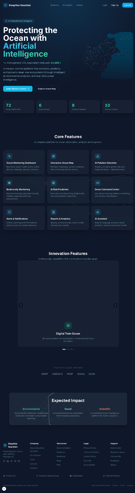

# DeepSea Guardian (DeepSee) 🌊📘

[](https://opensource.org/licenses/MIT)
[](https://github.com/tiwariraman884/DeepSee/actions)
[](https://nextjs.org/)
[](https://www.python.org/)

**DeepSea Guardian (DeepSee)** is an enterprise-grade, AI-powered autonomous marine intelligence and mission control platform. It acts as an automated mission control center for our oceans, providing real-time monitoring, anomaly detection, drone dispatch, and pollution forecasting.

<p align="center">
  
</p>

---

## 📖 Introduction: Why is this Project Important?

Our oceans cover over 70% of the planet, but more than 80% of deep-sea areas are completely unmonitored. 

**The Challenges:**
1. **Late Pollution Alerts**: Oil spills and chemical leaks often go unnoticed for days or weeks.
2. **Harm to Marine Life**: Endangered animals like sea turtles and whales get injured before help arrives.
3. **Expensive Manual Inspections**: Sending human research ships to check the deep sea is slow and costly.

**How DeepSea Guardian Solves This:**
It provides **24/7 automated monitoring**. When dirty water or a chemical leak is detected by an ocean sensor, the AI flags the emergency and dispatches an unmanned robot drone within seconds.

---

## ⚙️ How the System Works (End-to-End Flow)

```text
[1. Ocean Sensors & Buoys]
           │ (Measure pH, Oxygen, Temperature, Turbidity)
           ▼
[2. AI Brain & Cloud Backend]
           │ (Analyzes readings & detects abnormal spikes)
           ▼
[3. Live Mission Control Dashboard]
           │ (Displays live alerts, maps, and forecasts)
           ▼
[4. Autonomous Drones Dispatched]
           │ (Investigate hotspots and scan marine life)
```

---

## ✨ Key Features Explained Simply

### 1. ML Water Quality Anomaly Detector & Chemical Spill Simulator 🧪
- **Algorithm**: Scikit-Learn **Isolation Forest** unsupervised anomaly detector.
- **How it works**: Monitors water metrics (pH, oxygen, turbidity). If a chemical spill occurs, the water becomes acidic, oxygen drops, and water becomes murky.
- **Interactive Scenarios**: Test with a "Clean Ocean Baseline" or "⚠️ Trigger Chemical Spill Scenario".

### 2. Autonomous Drone Fleet Dispatch 🚁
- **Mission Control**: Tracks active drone units across sectors.
- **Emergency Dispatch**: Computes the nearest available drone route and dispatches `AquaDrone-Alpha` instantly for live video inspection.

### 3. Pollution Spread & 6-Hour Trajectory Forecast 📈
- **Method**: **Ridge Polynomial Regression**.
- **Visual Trajectory**: Renders hour-by-hour (+1h to +6h) projected severity progression curves to protect nearby beaches and coral reefs.

### 4. Marine Species Computer Vision Classifier 🐟
- **Model**: Transfer-learned **MobileNetV3-Small** (ImageNet-pretrained, 224×224).
- **Interactive Vision UI**: Users can click test samples (e.g., Hawksbill Turtle, Clownfish) or upload any fish photo. The AI scans and displays the species name with a confidence score.

### 5. Interactive Ocean Monitoring Map & Time Machine 🗺️⏳
- **Interactive Map**: Displays a worldwide dark-themed ocean map (Leaflet & OpenStreetMap) with colored pins for pollution hotspots, sensor buoys, and drone locations.
- **Ecosystem Time Machine**: Project ecosystem health across 1 Month, 6 Months, 1 Year, and 5 Year horizons.

---

## 🏗 System Architecture

```text
┌─────────────────────────────────────────────────────────────────────┐
│                        FRONTEND (Next.js 15 + React 19)             │
│                                                                     │
│  ┌──────────┐  ┌──────────┐  ┌──────────┐  ┌──────────┐           │
│  │Dashboard │  │Ocean Map │  │Species   │  │Drone     │           │
│  │(Zustand) │  │(Leaflet) │  │Classifier│  │Command   │           │
│  └────┬─────┘  └────┬─────┘  └────┬─────┘  └────┬─────┘           │
│       └──────────────┴──────────────┴──────────────┘                │
│                              │                                      │
│                    SSE / REST API calls                             │
└──────────────────────────────┼──────────────────────────────────────┘
                               │
┌──────────────────────────────┼──────────────────────────────────────┐
│                    BACKEND (Express + TypeScript)                   │
│                              │                                      │
│  ┌───────────────────────────┼───────────────────────────┐          │
│  │                           ▼                           │          │
│  │  ┌─────────┐    ┌──────────────┐    ┌─────────────┐   │          │
│  │  │EventBus │───▶│  ML Worker   │───▶│  SSE Push   │   │          │
│  │  │(Queue)  │    │  (RAM model) │    │  (Live UI)  │   │          │
│  │  └─────────┘    └──────────────┘    └─────────────┘   │          │
│  │        │                                              │          │
│  │        ▼                                              │          │
│  │  ┌──────────────┐                                     │          │
│  │  │ SQLite (WAL) │                                     │          │
│  │  │ Telemetry DB │                                     │          │
│  │  └──────────────┘                                     │          │
│  └───────────────────────────────────────────────────────┘          │
│                              │                                      │
│                    Python child_process                             │
└──────────────────────────────┼──────────────────────────────────────┘
                               │
┌──────────────────────────────┼──────────────────────────────────────┐
│                    ML ENGINE (Python 3.9+)                          │
│                              │                                      │
│  ┌───────────────────┐  ┌────────────────┐  ┌──────────────────┐    │
│  │ Isolation Forest  │  │ MobileNetV3    │  │ Ridge Polynomial │    │
│  │ (anomaly_model.pkl│  │ (species_      │  │ Regression       │    │
│  │ → Water Anomaly   │  │  classifier.pt)│  │ (forecast_       │    │
│  │   Detection       │  │ → Species CV   │  │  spread.py)      │    │
│  └───────────────────┘  └────────────────┘  └──────────────────┘    │
└─────────────────────────────────────────────────────────────────────┘
```

---

## 🛠️ Tech Stack

### Frontend
- **Framework**: Next.js 15.1 (App Router), React 19
- **Styling**: Tailwind CSS, Vanilla CSS animations, Glassmorphism design tokens
- **State Management**: Zustand (App Store, Auth Store, Alerts Store)
- **Maps**: Leaflet, React-Leaflet, CartoDB Dark Matter basemaps

### Backend
- **Runtime**: Node.js v20+, Express (TypeScript)
- **Database**: SQLite (`better-sqlite3`) for persistent missions, telemetry, and alerts
- **Inter-Process Communication**: Node.js `child_process` execution of Python ML subroutines
- **Validation**: Zod schema validation on all API inputs

### Machine Learning & Data Science
- **Environment**: Python 3.9+
- **Libraries**: Scikit-Learn, NumPy, Pandas, Pillow (PIL), Joblib, PyTorch, torchvision
- **Models**:
  - `ml/anomaly_model.pkl`: Isolation Forest for water quality telemetry.
  - `ml/species_classifier.pt`: Transfer-learned MobileNetV3-Small classifier.

---

## 🚀 Getting Started & Demo Guide

### Prerequisites
- **Node.js**: `v18.x` or `v20.x+`
- **Python**: `3.9+` with `pip`
- **Git**

### Installation

1. **Clone the repository**:
   ```bash
   git clone https://github.com/tiwariraman884/DeepSee.git
   cd DeepSee
   ```

2. **Install Dependencies**:
   ```bash
   npm install
   npm --prefix backend install
   npm --prefix frontend install
   
   # Python ML dependencies
   pip install numpy pandas scikit-learn pillow joblib torch torchvision
   ```

3. **Setup Environment Variables**:
   ```bash
   cp .env.example .env
   ```

### Running the Development Environment

Start the frontend and backend servers in **separate terminals**:

```bash
npm run dev:frontend   # Next.js dashboard  → http://localhost:3000
npm run dev:backend    # Express API + SSE → http://localhost:5000
```

### Docker (One-Command Setup)

```bash
docker-compose up --build
```
This starts both the backend (port 5000) and frontend (port 3000) in containers.

### How to Demo
1. **Open Mission Control**: Go to `http://localhost:3000`.
2. **Test Chemical Spill**: Scroll down to the AI Anomaly Detector and click **`⚠️ Trigger Chemical Spill Scenario`**. Watch the AI flag the anomaly.
3. **Dispatch Drone**: Click **`🚁 Dispatch Nearest Drone for Emergency Inspection`** to send the drone to the spill site.
4. **Forecast Spread**: Use the AI Spread Forecast tool, set severity, and click **`Generate 6h Forecast`**.
5. **Species Scanner**: Go to the Biodiversity tab, select a test sample or upload a photo, and see the AI classification.

---

## 🛡️ Security & Best Practices
- **Authentication**: JWT-based session auth with httpOnly cookies + API key support.
- **Input Validation & Sanitization**: Zod schemas validate every API request, and Python scripts feature regex-based payload parsers.
- **Rate Limiting**: 100 requests per minute per IP.
- **Zero Secret Exposure**: `.env` and sensitive DB files are ignored via `.gitignore`.
- **Graceful Degradation**: ML worker falls back to one-shot execution, classifier uses legacy `.pkl` if the main model fails.

---

## 📄 API Quick Reference

- `POST /api/sensors/predict`: Check telemetry for water quality anomalies.
- `POST /api/pollution/forecast`: Generate a 6-hour pollution spread trajectory.
- `POST /api/species/classify`: Base64 image to marine species classification.
- `GET /api/dashboard/overview`: Fetch real-time dashboard stats.

---

## 📜 License
Distributed under the **MIT License**. See `LICENSE` for more information.
