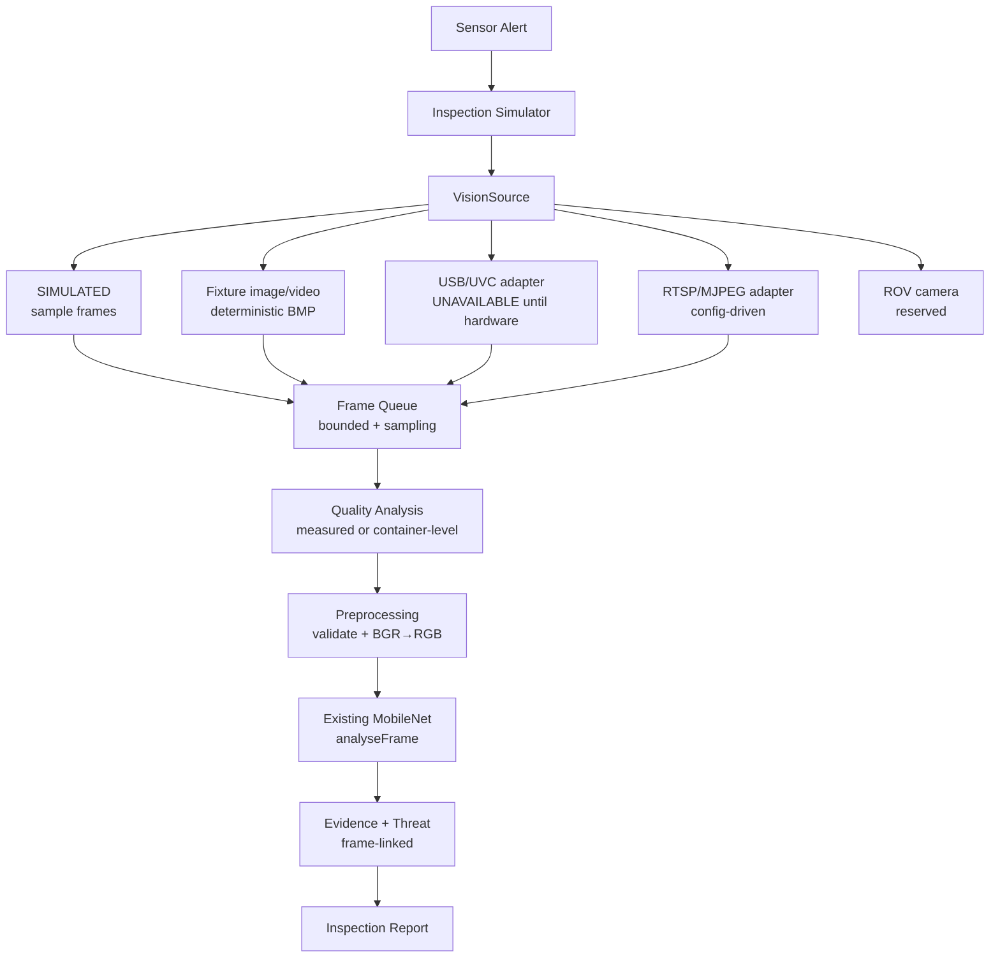

# DeepSee Vision Architecture (Phase 6D — Software Integration)

Source-agnostic underwater-vision ingestion. All camera sources normalize
into one `VisionFrame` contract and share one pipeline into the existing
resident MobileNet inference. No second ML pipeline exists.

## Status honesty

| Phase | Status |
|---|---|
| Software camera ingestion architecture | IMPLEMENTED |
| Fixture-based end-to-end vision path | VERIFIED (tests) |
| USB/RTSP adapters | READY (contracts + availability states) |
| ROV integration | RESERVED (types + status API only) |
| Physical camera validation | PENDING (no hardware) |
| Underwater field performance | NOT MEASURED |

## Modules (`backend/src/lib/vision/`)

| File | Role |
|---|---|
| `types.ts` | `VisionSourceType` enum, frame/quality/ROV contracts, `VisionError` codes |
| `bmp.ts` | Deterministic fixture BMP codec (no binaries in git) |
| `sources.ts` | `CameraSource` interface + 5 adapters + env factory |
| `quality.ts` | Measured (BMP) or container-level (JPEG/PNG/WEBP) analysis |
| `preprocess.ts` | Validation + BGR→RGB + options echo |
| `storage.ts` | `VisionFrameStorage` abstraction (local dir, bounded per inspection) |
| `pipeline.ts` | Bounded queue, sampling, inference, persistence, SSE/EventBus |
| `runtime.ts` | One managed source shared by inspections + status API |

## Key invariants

- Provenance is assigned only by the producing adapter; test sources can
  never display as hardware (`isTestVisionSource` / `isHardwareVisionSource`).
- Quality INVALID never fabricates metrics; simulation samples keep
  container-level validity so the legacy path is bit-identical.
- `stop()` is idempotent; queue/sampling/counters reset cleanly for tests.
- Frame bytes leave the backend ONLY via the authenticated frame API.
